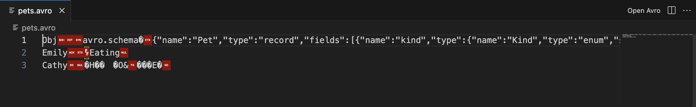
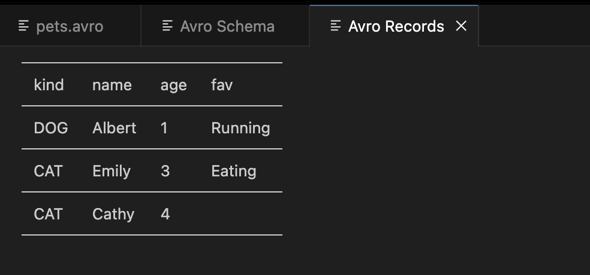
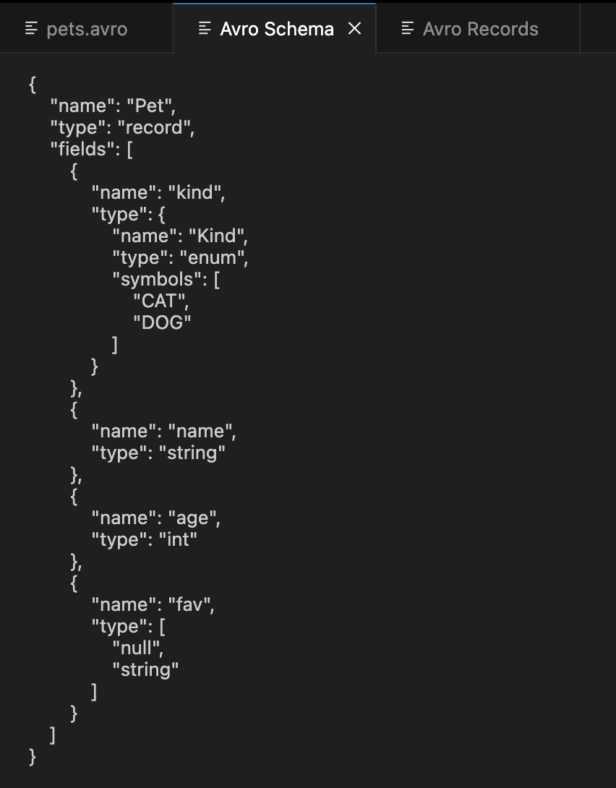

# avro-viewer README
This is a vscode extension that allows you to preview `.avro` files.
You can see not just records but also a schema in one time.

This can only handle .avro files with no compress (can't do with deflate/snappy compress).

## How to use
1. Open `.avro` file and click `Open Avro` button at the right top corner.

1. See the new tabs of the records and schema of the `.avro` file.

